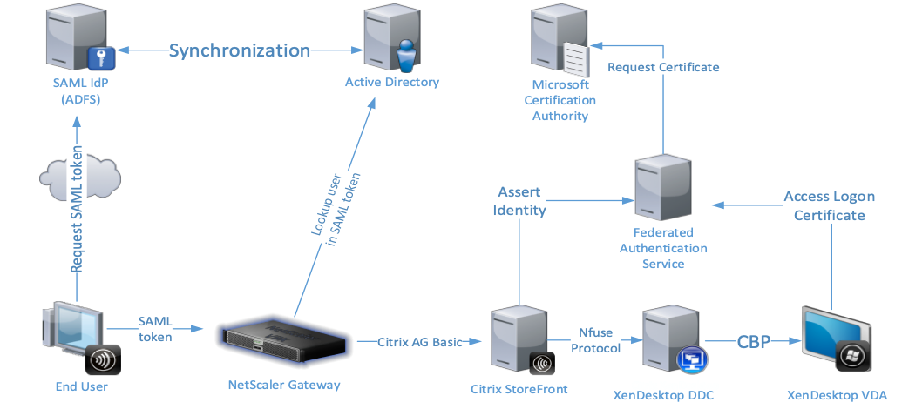

#Sample: Custom Integration with the Citrix Federated Authentication Service

##Overview

###Introduction

This sample for the StoreFront Authentication SDK demonstrates how to
create and add a StoreFront custom integration for modifying its
interactions with the Citrix Federated Authentication Service. Even more
complex customizations can be created by combining solutions created
with this SDK with solutions created with the Federated Authentication
Service Assertion Plugin SDK.

#### Citrix Federated Authentication Service

The Citrix Federated Authentication Service is a privileged component
designed to integrate with a Microsoft Certificate Authority. It
dynamically issues certificates for users, allowing them to log on to a
Citrix environment as if they had a smart card. This allows StoreFront
to use a broader range of authentication options, including those that
are password-free, and even those where the end user has no knowledge of
the account being used, such as SAML.

The following diagram shows the Citrix Federated Authentication Service integrating with a Microsoft Certificate Authority to provide services to StoreFront and Citrix
Virtual Apps and Desktops Virtual Delivery Agents (VDAs).



Trusted StoreFront servers contact the Citrix Federated Authentication
Service as users request access to the Citrix environment. The Citrix
Federated Authentication Service grants a ticket that allows a single
Citrix Virtual Apps and Desktops session to authenticate with a
certificate for that session. When a VDA needs to authenticate a user,
it connects to the Citrix Federated Authentication Service and redeems
the ticket. Only the Citrix Federated Authentication Service has access
to user certificates' private keys; the VDA must specifically send it
each signing and decryption operation that it needs to perform.

StoreFront interacts with the Citrix Federated Authentication Service in
two ways: when the user authenticates and when a resource is requested
to be launched.

#####Concepts

A user **rule** authorizes the issuance of certificates for VDA logon
and in-session use, as directed by StoreFront. Each rule specifies: the
StoreFront servers that are trusted to request certificates, the set of
users for which they can be requested, and the set of VDA machines
permitted to use them.

The interactions can optionally specify a **security context** in
addition to the optional rule described above. The security context is a
string that describes some aspect of the security stance, such as:
internal, external, in-the-office, etc.... When a security context is
specified, the Citrix Federated Authentication Service adds a Policy
OID: 1.3.6.1.4.1.3845.60.5.3.1 containing the security context string
verbatim to the certificates it creates.

Access **disposition** is a string which is generated by a customization
written by the StoreFront customization writer, using this SDK. The
disposition is consumed by a FAS Assertion Plugin written by the FAS
plugin writer, using the FAS Assertion Plugin SDK. The assertion plugin
converts the supplied disposition into a FAS rule and/or FAS security
context.

The disposition string encodes information pertaining to how StoreFront
is being accessed e.g. the user agent\'s IP address. The FAS plugin
writer is free to choose the information and format to place in the
disposition string.

Logon **evidence** is generated when the user logs on to the \"front
end\" (e.g. Citrix Gateway or StoreFront). When a published application
or desktop is subsequently launched, this evidence is supplied to the
FAS Assertion Plugin to provide extra assurance of a legitimate user.

Logon evidence takes the form of a list of \<string, byte\[\]\> pairs.
Each item in the list provides a piece of evidence:

-   string - the type of evidence

-   byte\[\] - the evidence value

At the time of writing, the only evidence type defined is: SAMLResponse
that provides evidence of SAML 2.0 authentication. For that type, the
evidence value is the UTF-8 bytes of the SAML \"Response\" element, as
defined by the SAML 2.0 specification in the XML namespace
\"urn:oasis:names:tc:SAML:2.0:protocol\".

#####Authentication

When the user authenticates to the StoreFront Authentication Service,
either directly or through single sign-on from Citrix Gateway,
information is captured about the user and used to generate claims,
through the use of a claims factory. For more details about claims
generation, see the section on Claim Generation in the StoreFront
Services Authentication SDK document. The built-in Federated
Authentication Claims factory uses the following method to communicate
with the Citrix Federated Authentication Service:

```
/// <summary>
/// Inform the Federated Authentication Service that it should prepare an identity
/// for the specified user.
/// </summary>
/// <param name="userPrincipalName">
/// The name of the user in the user principal name format.
/// </param>
/// <param name="sid">
/// The <seealso cref="SecurityIdentifier"/> associated with the specified user.
/// </param>
/// <param name="userRule">The optional user rule. </param>
/// <param name="security">The optional security context.</param>
/// <param name="disposition">The optional disposition.</param>
/// <param name="evidence">The optional list of evidences.</param>
void PrepareIdentity(string userPrincipalName,
                     SecurityIdentifier sid,
                     string userRule,
                     string securityContext,
                     string disposition,
                     List<KeyPairValue<string, byte[]>> evidence);
```

The built-in claims factory does not specify: security context,
disposition, evidence or the user rule, so the default rule is used.

#####Launch

When the user makes a launch request to a StoreFront Store, an
opportunity is given to a component implementing the following
interface, to provide alternate credentials to be used by the Citrix VDA
to start an interactive logon session.

```
/// <summary>
/// This interface defines a customization point for creating data for the Vda to
/// perform a custom logon.
/// </summary>
public interface IVdaLogonDataProvider
{
    /// <summary>
    /// Get the Vda logon data associated with the specified <seealso cref="IClaimsPrincipal"/>        
    /// </summary>
    /// <param name="claimsPrincipal">
    /// The <seealso cref="IClaimsPrincipal"/> to extract the Vda logon data from.
    /// </param>
    /// <param name="httpContext">
    /// The <seealso cref="HttpContextBase"/> from which optional data for disposition etc can be    
    /// determined.
    /// </param>
    /// <returns>The <seealso cref="VdaLogonData"/> or null if it was
    /// not possible to create the data.</returns>
    VdaLogonData GetVdaLogonData(IClaimsPrincipal claimsPrincipal, HttpContextBase httpContext);
}
```
A base implementation of this interface is provided, that utilizes the
following method to inform the Citrix Federated Authentication Service
that a specified user is about to logon to a VDA:

```
/// <summary>
/// Inform the Federated Authentication Service that the specified user, is about to logon
/// to a Vda.
/// </summary>
/// <param name="userPrincipalName">
/// The name of the user in the user principal name format.
/// </param>
/// <param name="sid">
/// The <seealso cref="SecurityIdentifier"/> associated with the specified user.
/// </param>
/// <param name="userRule">The optional user rule. </param>
/// <param name="security">The optional security context.</param>
/// <param name="disposition">The optional disposition.</param>
/// <param name="evidence">The optional list of evidences.</param>
void AssertIdentity(string userPrincipalName,
                    SecurityIdentifier sid,
                    string userRule,
                    string securityContext,
                    string disposition,
                    List<KeyPairValue<string, byte[]>> evidence);
```

The built-in implementation again does not specify: security context,
disposition, evidence or the user rule, and again the default rule will
be used.

### Sample

This sample demonstrates how to create a new claims factory, and a new
VDA logon data provider that derives the user rule and the security
context to send to the Citrix Federated Authentication Service. It also
demonstrates how to override the logic used to select a specific Citrix
Federated Authentication Service for the current user.

The sample demonstrates how to create StoreFront feature packages for
the two use cases, and are written such that the decisions regarding
extracting the user rule, security context and server selection are
abstracted into simple methods, that the customization author can
override.

### Administrator Experience

This sample is administered only by using the PowerShell modules
provided. The following assumes that the customizations are to be added
or removed from a Store at a virtual path: /Citrix/Store, with a
dedicated authentication service. If a Store is created with a different
name, then the `$StoreName` variable should be updated.

The following commands should be pasted in to a new instance of a
PowerShell command window, running as administrator

#### Add Customizations

```
cd "$Env:PROGRAMFILES\Citrix\Receiver StoreFront\Scripts"
& .\ImportModules.ps1

$siteId = "1"
$StoreName = "Store"
$StoreVirtualPath = "/Citrix/" + $StoreName
$AuthVirtualPath = $StoreVirtualPath + "Auth"

Install-CustomFasLogonDataProvider –siteId $siteId –virtualPath $StoreVirtualPath
Install-CustomFasClaimsFactory –siteId $siteId –virtualPath $AuthVirtualPath
```

#### Remove Customizations

```
cd "$Env:PROGRAMFILES\Citrix\Receiver StoreFront\Scripts"
& .\ImportModules.ps1

$siteId = "1"
$StoreName = "Store"
$StoreVirtualPath = "/Citrix/" + $StoreName
$AuthVirtualPath = $StoreVirtualPath + "Auth"

Uninstall-CustomFasLogonDataProvider –siteId $siteId –virtualPath $StoreVirtualPath
Uninstall-CustomFasClaimsFactory –siteId $siteId –virtualPath $AuthVirtualPath
```

#### Enable use of logon evidence

In the default deployment of StoreFront, the use of logon evidence is
disabled. Use the following PowerShell to enable it for the
Authentication Service associated with a store named: Store.

```
Get-Module “Citrix.StoreFront.*” –ListAvailable | Import-Module

$StoreName = "Store"
$StoreVirtualPath = "/Citrix/" + $StoreName
$store = Get-STFStoreService –VirtualPath $StoreVirtualPath
$auth = Get-STFAuthenticationService –StoreService $store

$auth.AuthenticationOptions.CollectFasEvidence = $true
$auth.Save()
```

**Note**: if the use of logon evidence is enabled, then it is required
that on the FAS Server that a FAS Assertion plugin module is deployed.
If an assertion plugin is not deployed then FAS will respond with
"Access Denied" to both PrepareIdentity() and AssertIdentity() methods.

###Installer

In common with the other samples, a pre-built installer is provided in
addition to the source code.

Before attempting to deploy the pre-built sample installers, it is
**required** to add the certificate at
AuthSDK.zip/Certificates/YourCompany.cer to the Third-Party Root
Certification Authorities store of the Local Computer account of all the
machines where StoreFront is installed. This is not required for the
development machine. If this step is not completed, then it will not be
possible to deploy the solution because the digital signature of the
PowerShell modules associated with this customization will fail to
verify.

Note: If the installer is being deployed to a StoreFront Server Group,
it must be run on all servers in the group.

Before attempting to uninstall a sample, the associated claims factory
must first be removed using the provided PowerShell, as described above.
If this is not done, attempting to uninstall will result in a dialog
informing the administrator that the feature should be removed using the
StoreFront Administration Console first. The sample can then be removed
by using the standard "Add/Remove Programs" control panel applet.

## Code Sample

This sample demonstrates how to modify StoreFront to request different
user rules and security contexts from the Citrix Federated
Authentication Service from the same store. The logic uses the presence
of the Access Info claim, created when single sign-on has occurred from
Citrix Gateway, to infer whether the request was made by an "internal"
user accessing from a machine on the corporate LAN, or by an "external"
user accessing through Citrix Gateway. The solution uses this logic to
determine which user rule should be used, either one named "INTERNAL" or
"EXTERNAL".

Note: This requires that the above user rules have been created in the
Citrix Federated Authentication deployment, see the Citrix Federated
Authentication Service Administration Guide for more details.

The sample also demonstrates using the client IP address as the security
context information, to be added to the certificate.

### Visual Studio Solution Layout

This sample demonstrates a subset of the available aspects of the SDK,
and is composed of seven projects:

-   *ClaimsFactoryPowershell* contains the PowerShell module to be used
    for managing the customized claims factory.
-   *CustomFasClaimsFactory* contains the functionality for the custom
    claims factory:
    -   The custom claims factory
    -   A start-up module to add the custom claims factory to the IoC
        with the required name
-   *CustomFasVdaLogonDataProvider* contains the functionality for the
    VDA logon data provider, including:
    -   The custom VDA logon data provider
    -   A start-up module to add the custom VDA logon data provider to
        the IoC with the required name
-   *LogonDataProviderPowershell* contains the PowerShell module to be
    used for managing the customized VDA logon data provider
-   *Installer* is a WiX project to create an msi installer to deploy
    and remove this customization. It also contains the StoreFront
    Feature Package definitions and builds the Feature Packages.
-   *Installer.CustomActions* contains the msi custom actions required
    to deploy and remove the StoreFront Features.
-   *UnitTests* contains some unit tests to verify the merging of the
    code and configuration into the authentication service, verify the
    behavior of the Service Locator.

This sample does not require any configuration, and so does not contain
a configuration project or a StoreFront Administration Console
Extension. It also requires no custom deployment steps and so does not
have a Feature Installer project.

All the projects target the .NET Framework 4.5 and the MSIL platform,
unless specifically stated. Projects that target .NET Framework 3.5 are
either part of the StoreFront Administration Console, or loaded by the
Console. The rationale behind this is discussed in the StoreFront
Services Authentication SDK document.

### Custom Claims Factory Projects

There are two projects for the custom claims factory: the claims factory
itself, and the PowerShell used to manage it.

#### CustomFasClaimsFactory

This project contains two principal classes: the implementations of the
start-up module and the claims factory. The claims factory is written so
that the extraction and manipulation of: the user rule, the security
context, the disposition and evidence are encapsulated in the following
methods:

```
/// <summary>
/// Method to determine the user rule.
/// This is overridden by customizations to specify a rule for the user.
/// </summary>
/// <param name="httpContext">The http context of the authentication request</param>
/// <param name="result">
/// The optional <seealso cref="AuthenticationResult"/>, this may be null
/// </param>
/// <param name="standardClaims">The list of standard claims already created.</param>
/// <returns>The user rule.</returns>
protected virtual string GetUserRule(HttpContextBase httpContext, AuthenticationResult result,
                                     List<Claim> standardClaims);

/// <summary>
/// Method to determine the security context associated with the request.
/// This is overridden by customizations to determine the current security context.
/// </summary>
/// <param name="httpContext">The http context of the authentication request</param>
/// <param name="result">
/// The optional <seealso cref="AuthenticationResult"/>, this may be null
/// </param>
/// <param name="standardClaims">The list of standard claims already created.</param>
/// <returns>The security context.</returns>
protected virtual string GetSecurityContext(HttpContextBase httpContext,
                                            AuthenticationResult result,
                                            List<Claim> standardClaims);

/// <summary>
/// Method to determine the disposition associated with the request.
/// The dispostion is an arbitrary string generated by a third-party customization that will have
/// meaning to a FAS server customization.
/// This is overridden by customizations.
/// </summary>
/// <param name="httpContext">The http context of the authentication request</param>
/// <param name="result">
/// The optional <seealso cref="AuthenticationResult"/>, this may be null
/// </param>
/// <param name="standardClaims">The list of standard claims already created.</param>
/// <returns>The disposition.</returns>
protected virtual string GetDisposition(HttpContextBase httpContext, AuthenticationResult result, 
                                        List<Claim> standardClaims);

/// <summary>
/// Select the Federated Authentication Service.
/// This may be overridden by customizations that wish to impose their
/// own load balancing rules.
/// </summary>
/// <param name="userUpn">The userPrincipalName of the user to be logged on</param>
/// <param name="httpContext">The http context of the authentication request</param>
/// <param name="result">
/// The optional <seealso cref="AuthenticationResult"/>, this may be null
/// </param>
/// <param name="standardClaims">The list of standard claims already created.</param>
/// <returns>The selected <seealso cref="FederatedAuthenticationServer"/></returns>
protected virtual FederatedAuthenticationServer SelectServer(string userUpn,
            HttpContextBase httpContext, AuthenticationResult result,
            List<Claim> standardClaims);

/// <summary>
/// Allow the default <seealso cref="LogonEvidence"/> to be customized before
/// it is sent to FAS.
/// This is overridden by customizations.
/// </summary>
/// <param name="logonEvidence">The <seealso cref="LogonEvidence"/> to manage</param>
/// <param name="httpContext">The http context of the authentication request</param>
/// <param name="result">
/// The optional <seealso cref="AuthenticationResult"/>, this may be null
/// </param>
/// <param name="standardClaims">The list of standard claims already created.</param>
protected virtual void ManageLogonEvidence(LogonEvidence logonEvidence,
                                           HttpContextBase httpContext,
                                           AuthenticationResult result,
                                           List<Claim> standardClaims);
```

#### ClaimsFactoryPowershell

This project contains the PowerShell module for managing the claims
factory. This projects' sole responsibility is to sign the PowerShell.

### Custom VDA Logon Data Project

There are two projects for the custom VDA logon data provider: the VDA
logon data provider itself, and the PowerShell used to manage it.

#### CustomFasVdaLogonDataProvider

This project contains two principal classes: the implementations of the
start-up module and the custom Federated Authentication Service based
VDA logon data provider. The logon data provider is written so that the
extraction and manipulation of: the user rule, the security context, the
disposition, and the list of evidences are encapsulated in the following
methods:

```
/// <summary>
/// Get the rule assoicated with the current request.
/// It is expected that customizations will override this method.
/// </summary>
/// <param name="claimsPrincipal">
/// The incoming <seealso cref="IClaimsPrincipal">claims principal</seealso>
/// </param>
/// <param name="httpContext">
/// The <seealso cref="HttpContextBase"/> associated with the launch request
/// </param>
/// <returns>null, which means the default rule.</returns>
protected virtual string GetUserRule(IClaimsPrincipal claimsPrincipal,
                                     HttpContextBase httpContext);
```

```
/// <summary>
/// Get the security context assoicated with the current request.
/// It is expected that customizations will override this method.
/// </summary>
/// <param name="claimsPrincipal">
/// The incoming <seealso cref="IClaimsPrincipal">claims principal</seealso>
/// </param>
/// <param name="httpContext">
/// The <seealso cref="HttpContextBase"/> associated with the launch request
/// </param>
/// <returns>null, which means the default security context.</returns>
protected virtual string GetSecurityContext(IClaimsPrincipal claimsPrincipal,
                                            HttpContextBase httpContext);

```

```
/// <summary>
/// Method to determine the disposition associated with the request.
/// The dispostion is an arbitrary string generated by a third-party customization that will have
/// meaning to a FAS server customization.
/// This is overridden by customizations.
/// </summary>
/// <param name="claimsPrincipal">
/// The incoming <seealso cref="IClaimsPrincipal">claims principal</seealso>
/// </param>
/// <param name="httpContext">
/// The <seealso cref="HttpContextBase"/> associated with the launch request
/// </param>
/// <returns>The disposition</returns>
protected virtual string GetDisposition(IClaimsPrincipal claimsPrincipal,
                                        HttpContextBase httpContext);

```

```
/// <summary>
/// Select the Federated Authentication Service to use.
/// Override this to implement a custom load-balancing scheme
/// </summary>
/// <param name="claimsPrincipal">
/// The incoming <seealso cref="IClaimsPrincipal">claims principal</seealso>
/// </param>
/// <param name="httpContext">
/// The <seealso cref="HttpContextBase"/> associated with the launch request
/// </param>
/// <param name="upn">The user to assert the identity for, as a userPrincipalName</param>
/// <returns>The selected <seealso cref="FederatedAuthenticationServer"/></returns>
protected virtual FederatedAuthenticationServer SelectServer(IClaimsPrincipal claimsPrincipal,
   
                                                 HttpContextBase httpContext, string upn);
```
                                                
```
/// <summary>
/// Allow the default <seealso cref="LogonEvidence"/> to be customized before it is sent to FAS.
/// This is overridden by customizations.
/// </summary>
/// <param name="logonEvidence">The <seealso cref="LogonEvidence"/> to manage</param>
/// <param name="claimsPrincipal">
/// The incoming <seealso cref="IClaimsPrincipal">claims principal</seealso>
/// </param>
/// <param name="httpContext">
/// The <seealso cref="HttpContextBase"/> associated with the launch request
/// </param>
protected virtual void ManageLogonEvidence(LogonEvidence logonEvidence,
                         IClaimsPrincipal claimsPrincipal, HttpContextBase httpContext);
```

#### LogonDataProviderPowershell

This project contains the PowerShell module for managing the custom VDA
logon data provider. This projects' sole responsibility is to sign the
PowerShell.

### Installer Project

This WiX project is responsible for the following:

-   Creating the StoreFront Feature Packages
-   Creating an installer to:
    -   Deploy the Feature Packages
    -   Deploy the PowerShell modules for managing the features

Note: This project is targeted at the x64 platform.

### Installer.CustomActions Project

This C\# class library project uses the standard pattern, as described
in the StoreFront Authentication SDK document, for removing the feature
classes.

Notes:
-   This project is targeted at .NET Framework 3.5.
-   This project is targeted at the x64 platform to ensure that it has
    access to the correct registry locations.

### Unit Tests Project

This project contains standard web.config merge and unmerge, route, and
service location tests.
