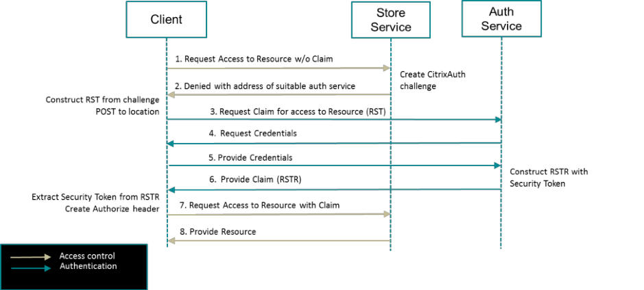
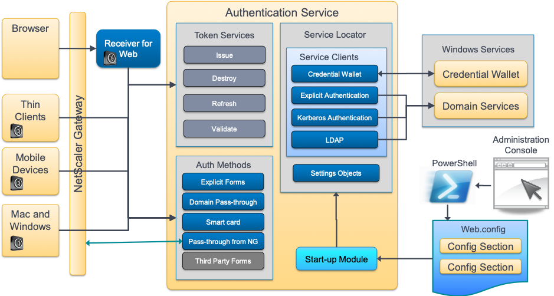
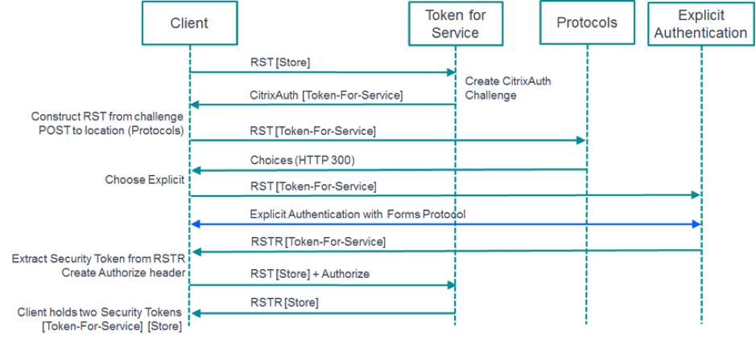
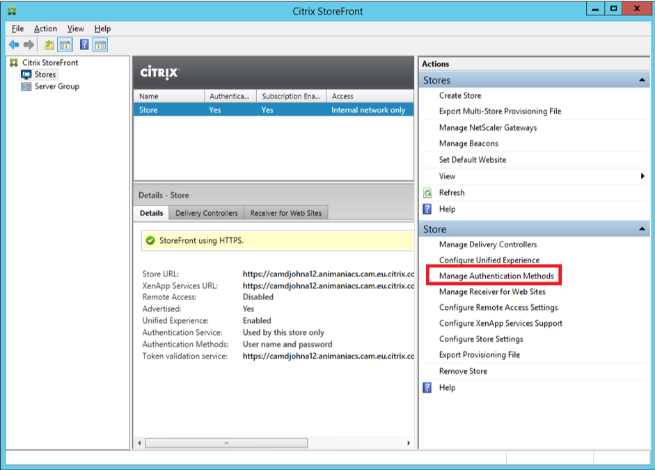
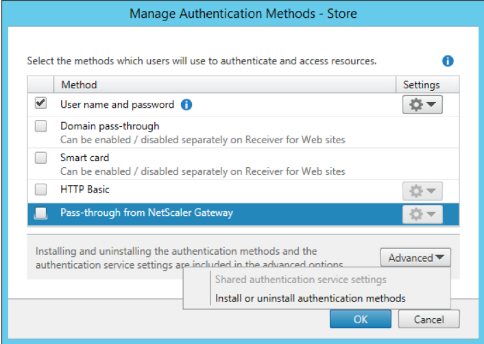
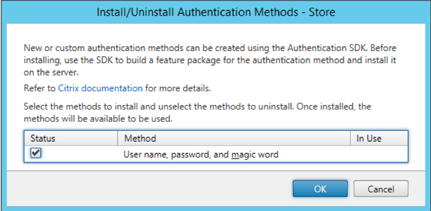
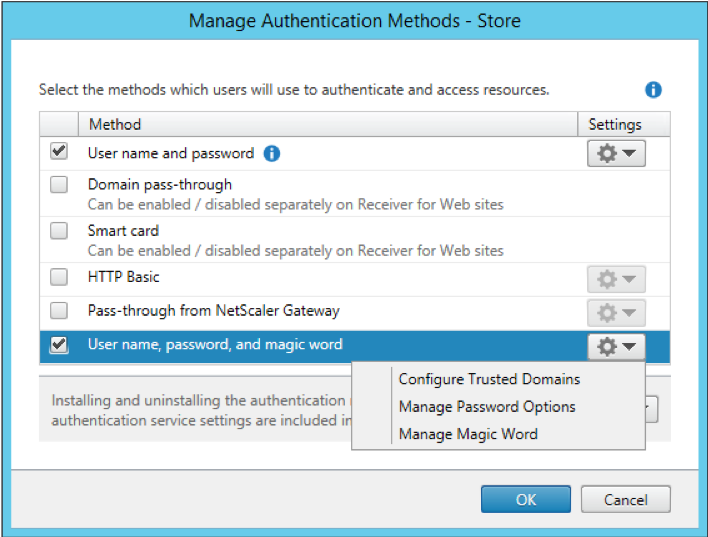

# Citrix StoreFront Services 1811 Authentication SDK

## Introduction

### Scope

This document describes the StoreFront Services 1811.1.0 Authentication Software Development Kit. It describes how to use the SDK to develop new custom forms-based authentication methods, or new authentication protocols. This document also describes how the customizations can be delivered and deployed on existing servers running StoreFront Services 1811.1.0.

The SDK requires a working knowledge of the Microsoft .NET Framework (<http://msdn.microsoft.com/en-US/vstudio/aa496123>) and in particular the C# programming language (<http://msdn.microsoft.com/en-us/library/vstudio/z1zx9t92(v=vs.100).aspx>). 

### Deliverables

This SDK contains the following deliverables, packaged into a single compressed archive:

* **Assemblies**: The external and StoreFront assemblies referenced by the samples, including any associated xml documentation files
* **Documentation**: This document and its supporting documentation
* **Installers**: Pre-built installers for the samples
* **Merge**: Files used by the sample unit tests
* **Tools**: The tools used to build the samples and run the unit tests
* **Samples**
	* **CertificateIdentityDeclaration**: A sample to illustrate a new authentication protocol
	* **Custom FAS Sample**: A sample illustrating how to add complex behaviours to the interactions with the Citrix Federated Authentication Service [12]
	* **Magic Word Sample**: A simple authentication form that demonstrates a full implementation
	* **Test Forms**: A sample to demonstrate the use of User Interface Elements in a series of custom forms. This also illustrates the use of the Receiver forWeb JavaScript API.
	* **Plugin Test Forms**: This demonstrates how to create a plugin for the Receiver forWeb javascript API, used with the Test Forms sample.
	* **U2F**: A sample to illustrate how to use FIDO Universal Second Factor (<https://fidoalliance.org/specifications/overview/>) in a Citrix Form. This also illustrates the use of the Receiver for Web JavaScript API.
	
The samples contain Visual Studio 2017 solutions, C# source code that builds msi installers that can be used to deploy the sample to a StoreFront 1811.1.0 deployment. The samples also contain unit tests focussed around testing the form implementation, or the authentication protocol.

#### Prerequisites

The following prerequisites are required, installed in the following order:

* Visual Studio (2017 or later)
	* On Windows Server 2012 and later .NET 3.5 SP1 will need to be installed in order to be able to target .Net 3.5 SP1 as required for some project types.
* The following Visual Studio Extensions are also required
	* To run the unit tests: **NUnit 2 Test Adapter for Visual Studio 2017** 
	* To build the example installers: **Wix Toolset Visual Studio 2017 Extension**

### References

[1] [RFC 2617 HTTP Authentication: Basic and Digest Access Authentication](http://tools.ietf.org/html/rfc2617)

[2] [CitrixAuth Authentication Scheme 1811](citrixauth-authentication-scheme.md)

[3] [Security Token Services API 1811](security-token-services-api.md)

[4] [Citrix Common Authentication Forms Language 1811](common-authentication-forms-language.md)

[5] [ASP.Net MVC 4](http://www.asp.net/mvc/mvc4)

[6] [The Service Locator Pattern](http://msdn.microsoft.com/en-us/library/ff648968.aspx)

[7] [Authenticode](http://msdn.microsoft.com/en-us/library/ms537359(v=vs.85).aspx)

[8] [Time Stamping Authenticode Signatures](http://msdn.microsoft.com/en-us/library/windows/desktop/bb931395(v=vs.85).aspx)

[9] [StoreFront Authentication Form Generation 1811](storefront-authentication-form-generation.md)

[10] [StoreFront Authentication SDK JavaScript API 1811](storefront-authentication-sdk-javascript.md)

[11] [Citrix StoreFront PowerShell SDK](https://developer-docs.citrix.com/projects/storefront-powershell-sdk/en/latest/)

[12] [Citrix Federated Authentication Service](https://docs.citrix.com/en-us/citrix-virtual-apps-desktops/secure/federated-authentication-service.html)


## StoreFront Services Authentication Overview

### Identity Management Systems

Traditional systems have centralized identity management systems where each application is responsible for authenticating the user and establishing their identity. This has led to multiple implementations of authentication and authorization systems and applications with differing levels of support for different authentication methods.

In federated systems the user authenticates once, to an appropriate authentication service, which gathers information about the user. This information often takes the form of assertions or claims regarding the user. The claims are then marshalled to other applications or services that rely on the authentication service. These "relying parties" have been configured to trust the assertions/claims issued by the authentication service, or "trusted issuer" and this is commonly enforced by strong cryptographic means such as digital signing and encipherment. The assertions/claims are marshalled as security tokens that are issued by the trusted issuer, held by the application, and presented to other services to gain access to data and services.



### The Authentication Service

The StoreFront Authentication Service is a web application, hosted in IIS, which makes extensive use of the ASP.NET MVC Framework 4.0 [5]. In a change to previous versions, there can be many instances of the Authentication Service. The administrator can choose to have one per store, or share an Authentication Service between nominated Stores. By default, a new Authentication Service is created when a new Store is created. The service is usually hosted at the relative URL: /Citrix/\<Store Name>Auth of the chosen IIS web site. HTTP requests are routed by IIS, ASP.NET and the MVC framework to Controllers for processing.

Upgrading from a previous version to StoreFront 1811.1.0 will maintain the original shared Authentication Service.

New authentication methods are added by adding new ASP.NET Routes into the web application and mapping them to new Controllers. For forms based authentication, the forms are rendered using a custom mechanism based on ASP.Net Razor templates [9].

Configuration data is stored in the associated web.config file. When the web application starts, a configured set of start-up modules are run, which parse the configuration into settings objects that are stored in a Service Locator [6], along with other long-lived objects.



The StoreFront Administration Console utilizes a PowerShell layer to configure the solution. The PowerShell layer makes extensive use of a custom configuration provider that allows certain portions of the web.config file to be accessed as if it were a mounted driver. This simplifies accessing the configuration data using standard PowerShell commands.

StoreFront 1811.1.0 also implements a new PowerShell based SDK [11], alongside the original SDK.

### Receiver for Web JavaScript API

StoreFront 1811.1.0 has a JavaScript API for Receiver for Web. This allows plug-ins to be created that complement the forms created using the Citrix Common Forms Protocol, to display new user interface widgets and to automatically capture credentials. For more information see [10], and for examples, investigate the Test Forms and FIDO U2F samples.

### Authentication Support Services

In addition to the Authentication web application, there are additional Windows services that provide functionality requiring higher levels of privilege. The Authentication web application communicates with these WCF services utilizing named pipes for the communication channel. Access to these services is controlled through membership of local Windows groups.

#### Credential Wallet

The Credential Wallet is a WCF service hosted in a Windows service called Citrix Credential Wallet, or its localized variant. The hosted Credential Wallet service is an in-memory hash table that securely stores encrypted passwords.

The samples demonstrate how to store passwords in the Credential Wallet by utilizing the existing functionality in one of the specialized claims.

#### Domain Services

The Domain Services host WCF services that provide the functionality to authenticate a user by using explicit credentials  (user name and password), or utilizing Kerberos Service-for-User for both user principal names and certificates.

The default is to create one Domain Services called Citrix Default Domain Services, or the localized variant, which provides authentication and LDAP services for the domain that the server is currently a member of, or an associated trust scope.

The samples demonstrate how to delegate credential validation to the most appropriate service described above.

#### XML Service Authentication

When StoreFront is not in the same Active Directory domain as Citrix Virtual Apps and Desktops , and it is not possible to put Active Directory trusts in place, you can configure StoreFront to use the Citrix Virtual Apps and Desktops XML Service to authenticate the user name and password credentials. Further details can be found at: <https://docs.citrix.com/en-us/storefront/current-release/configure-authentication-and-delegation/xml-authentication.html>. 

### Relying Party Authentication: CitrixAuth

As described above, a relying party, such as the Store service, can challenge for authentication at any point. This challenge takes the form of an RFC2617 [1] extension. It uses the standard HTTP WWW-Authenticate header for the challenge and the Authorization HTTP header as the response. Further information can be found in the CitrixAuth Scheme document [2].

When a client receives a challenge, it must respond by constructing and sending a Request Security Token (RST) to the location specified in the challenge. The details of how to construct the RST can be found in the CitrixAuth Authentication Scheme document [2]. The client should expect to receive a Request Security Token Response (RSTR) message in response to the RST message. The location to which the RST is sent, will be the Token Issuing Service. The RSTR that is returned will contain the security token that can be used to access the required resource in the response to the challenge, plus additional information to assist the client with caching the token.

For more information on the endpoints and expected messages, see the Security Token Services API document [3].

### Primary Authentication

The Token Issuing Service is itself a relying party that issues challenges if an appropriate security token is not present. The location associated with the challenge is the protocol choices endpoint that allows a negotiation between the client and the authentication service regarding which authentication method should be used.
 

 
The following protocols are supported in this version:

#### User name and Password

A user is required to explicitly provide their domain-qualified user name and password. The credentials are transported to the StoreFront server using the Citrix Common Forms protocol. StoreFront then uses either the Domain Services, or the Broker Xml Service, described above, to validate the credentials and to obtain the group information.

#### Domain Pass-through

The desktop session credentials are used to “silently” authenticate to StoreFront. The credentials are passed to StoreFront by utilizing the IIS Integrated Windows Authentication feature which validates the credentials provides the group information.

#### Smart Card

Smart card authentication. StoreFront utilizes the IIS built-in TLS client certificate authentication feature to obtain the user certificate and then utilizes the Domain Services, described above, to: map the certificate to an Active Directory account, partially validate the account, and obtain the group information.

#### HTTP Basic

This is used by third-party client integrations and web portals, where an external user interface has been used to capture a domain-qualified user name and password. StoreFront utilizes the Basic Authentication feature in IIS to transport the credentials to the StoreFront server. StoreFront then uses either the Domain Services, or the Broker Xml Service, described above, to validate the credentials and to obtain the group information.

#### Pass-through from Citrix Gateway

This allows single sign-on from Citrix Gateway and operates in two modes, depending on whether a password was used to authenticate to Citrix Gateway.

If a password was used, the password is sent to StoreFront in the single sign-on protocol. StoreFront then uses either the Domain Services, or the Broker Xml Service, described above, to validate the credentials and to obtain the group information.

If a password is not used to authenticate to Citrix Gateway, and StoreFront has been configured to “Fully delegate credential validation to NetScaler Gateway”, then the user principal name is transmitted from Citrix Gateway to StoreFront, which utilizes the Domain Services, described above, to: partially validate the account, and obtain the group information.

#### Citrix Federation

This is an internal authentication mechanism to StoreFront based on the CitrixAuth protocol described above, to allow different components to federate identity. This authentication method is always enabled, but is not displayed in the StoreFront Administration Console.

### Claim Generation

The security tokens used by StoreFront are serializations of a set of claims created during primary authentication. The generation of the claims by the Citrix developed authentication methods is controlled by objects implementing the following interface:

```
/// <summary>
/// This interface defines a factory for creating a collection of claims
/// </summary>
public interface IClaimsFactory
{
    /// <summary>
    /// Build the claims from the http request and authentication result, and optional
    /// additional claims.
    /// </summary>
    /// <param name="httpContext">
    /// The <seealso cref="HttpContextBase"/> of the authentication request
    /// </param>
    /// <param name="requestToken">
    /// The <seealso cref="RequestToken"/>. Note this may be potentially updated by 
    /// the created claims.
    /// </param>
    /// <param name="result">The <seealso cref="AuthenticationResult"/></param>
    /// <param name="issuer">The issuer of the claim</param>
    /// <param name="originalIssuer">The original issuer, may be null</param>
    /// <param name="additionalClaims">Any, optional, additional claims.</param>
    /// <returns>The collection of constructed claims</returns>
    IEnumerable<Claim> BuildClaims(HttpContextBase httpContext,
                                   RequestToken requestToken,
                                   AuthenticationResult result,
                                   string issuer, string originalIssuer,
                                   IEnumerable<Claim> additionalClaims);

    /// <summary>
    /// Build the claims from the http request and authentication result, and optional
    /// additional claims.
    /// </summary>
    /// <param name="httpContext">
    /// The <seealso cref="HttpContextBase"/> of the authentication request
    /// </param>
    /// <param name="issuer">The issuer of the claim</param>
    /// <param name="incomingClaimsPrincipal">The incoming claims principal</param>
    /// <param name="additionalClaims">Any, optional, additional claims.</param>
    /// <returns>The collection of constructed claims</returns>
    IEnumerable<Claim> ReissueClaims(HttpContextBase httpContext, string issuer,
                    IClaimsPrincipal incomingClaimsPrincipal,
                    IEnumerable<Claim> additionalClaims);
}
```
The authentication service has a built-in implementation, created at start-up, and stored in the service locator with the name: `standardClaimsFactory`. It is **recommended** that this be used in customizations, but it is made possible to configure a different implementation defined by a name in the service locator, see the Set-STFClaimsFactoryNames PowerShell command at: <https://developer-docs.citrix.com/projects/storefront-powershell-sdk/en/latest/Set-STFClaimsFactoryNames/>
 
### Common Forms

Many authentication schemes require users to directly provide information in order to prove their identity. StoreFront uses the Common Authentication Forms Language to allow the server to specify what information should be collected.

Two of the samples illustrate developing custom forms-based protocols. The flow of forms and responses constitutes a conversation that can have state associated with the overall conversation. For maximum interoperability, the protocol is a REST API (XML Forms transmitted over HTTPS) and is described in [4].

In this version of the SDK, the protocol identifier: CustomForms, is defined. The clients are required to recognize this protocol identifier and map it to their existing Common Forms rendering. Clients will give preference to this new protocol over the existing ExplicitForms protocol, should both be available. The expectation is that any organization will only implement, or purchase, a single custom authentication mechanism for their organization, so multiple vendors advertising their customizations in this way should not be an issue.


### Delegated Forms Authentication

In order to extend the reach of any customization to include Citrix Gateway, Citrix has defined a protocol for delegating forms authentication to a customized StoreFront deployment.

As there is no longer a single authentication service, the delegated forms endpoint is hosted in its’ own Authentication Service, and there is one per StoreFront tenant. The endpoint is at the relative Url: `/Citrix/DelegatedForms/<tenant path>`. By default the built-in user name and password authentication is deployed to this Authentication Service.

It is possible to configure the Delegated Forms Server to use customized forms conversations created with this SDK, allowing both internal and external clients to share the customized experience.

In this release, the delegated forms functionality is configured from PowerShell only. A description of the high-level commands can be found at:
<https://docs.citrix.com/en-us/storefront/3-5/integrate-with-netscaler-and-netscaler-gateway/sf-configure-ext-auth.html>

It is expected that the PowerShell required to configure the delegated forms to use the specific customization shall be wrapped in a simple PowerShell command by the customization author and provided as part of the customization.


## StoreFront Management Overview

The deployment and management of StoreFront is based around PowerShell and a Microsoft Management Console (MMC) snap-in that orchestrates the PowerShell commands. The following sections describe where management data is stored and managed.

### Registry

The Windows registry is used to store the following information:

***Key***: HKLM\SOFTWARE\Citrix\DeliveryServices

***Values***

- **AdminConsoleOperationMode**: This controls the operational mode of the StoreFront Administration Console
- **CertificateStoreName**: The name of the private machine certificate store used by StoreFront
- **ClockSkew**: The amount of clock skew allowed when comparing validity periods for authentication tokens
- **ConfigurationLevel**: This value is used to compare two servers when replicating data
- **FrameworkControllerAssemblyPath**: The path of an assembly that implements the StoreFront framework controller
- **FrameworkControllerType**: The type of the class that implements the framework controller in the assembly at: FrameworkControllerAssemblyPath
- **IISAssemblyPath**: The path of an assembly that implements the IIS manager
- **IISManagerType**: The type of the class that implements the IIS manager in the assembly at: IISAssemblyPath
- **InstallDir**: The path where StoreFront is installed, which is usually: %PROGRAMFILES%\Citrix\Receiver StoreFront
- **WindowsInstallerAssemblyPath**: The path of an assembly that implements the StoreFront Windows installer functionality
- **WindowsInstallerType**: The type of the class that implements the Windows installer functionality in the assembly at: WindowsInstallerAssemblyPath

***Key***: HKLM\SOFTWARE\Citrix\DeliveryServices\FrameworkControllerData

***Values***

- **DirectoryPath**: The path to the directory that stores the StoreFront framework controller data

***Key***: HKLM\SOFTWARE\Citrix\DeliveryServicesManagement

***Values***

- **AdminMscFileLocation**: The StoreFront Management Console snap-in configuration file
- **InstallDir**: The StoreFront management installation directory, which is usually: %PROGRAMFILES%\Citrix\Receiver StoreFront\Management

The following key contains sub-keys that control the scope nodes in the StoreFront Administration Console (see [Authentication Management SDK](#authentication-management-sdk)):

HKLM\SOFTWARE\Citrix\DeliveryServicesManagement\Plugins

Each key can contain the following values:

- **IsEnabled**: This controls whether the associated scope node is displayed
- **IsFirstUsePlugin**: Determines whether the associated node participates in the First-Time Use experience
- **OrderingHint**: This controls the order in which the scope nodes are displayed in the StoreFront Administration Console
- **Parent**: This specifies the parent of the associated scope node

The Windows registry is also used by the Authentication SDK. The following key contains a sub-key named Extensions:

HKLM\SOFTWARE\Citrix\DeliveryServicesManagement\Plugins\Authentication

Every authentication method should add a sub-key to the Extensions key, with a default value that specifies the assembly that contains the implementation of the Authentication SDK management plug-in as described in [Authentication Management SDK](#authentication-management-sdk).

The assemblies described above should be located at the path specified by the InstallDir value of the key:

HKLM\SOFTWARE\Citrix\DeliveryServicesManagement.

### Framework Controller Data

The StoreFront framework controller data for this release is stored in an XML file at the path specified by the DirectoryPath value of the key: 

HKLM\SOFTWARE\Citrix\DeliveryServices\FrameworkControllerData.

This file contains the information about which features are currently deployed, including Windows Services, web applications etc, and is used by the StoreFront Framework controller for deployment management.

The data stored here is managed by the PowerShell API and should not be manually updated.

### Configuration Data

Most of the configuration data for individual StoreFront components is stored in the web.config file of the associated web application, or in the application.config file for Windows services.

These configuration settings are managed by the StoreFront PowerShell SDK [11].

#### Service Locator

The basic idea behind a service locator is to have an object that knows how to get hold of all of the services that an application might need. StoreFront makes extensive use of service location and inversion-of-control (IoC) containers; see <http://martinfowler.com/articles/injection.html> for more details of this software pattern. For the StoreFront services to access the configuration data the following procedure is often followed:

1.	Create a configuration section.
2.	Create a simple data class that holds all the required settings.
3.	Create a parser class that takes a configuration sections and creates a settings data object.
4.	Create a start-up module that uses the parser to create an instance of the settings object in the service locator.
5.	Obtain access to the settings objects, where required, through the service locator.


#### Start-up Modules

A start-up module for a web application is a class that implements the following interface:

```
namespace Citrix.DeliveryServices.Mvc
{
    /// <summary>
    /// Interface implemented by modules for executing code during the
    /// application startup.
    /// </summary>
    public interface IStartupModule
    {
        /// <summary>
        /// The Initialize method of each registered component is called
        /// at application startup (MvcCoreWebApplication).
        /// Throwing an exception stop the application startup.
        /// </summary> 
        void Initialize();

        /// <summary>
        /// Registers components (put all registration here unless a component                  
        /// requires registering before/after other components).
        /// </summary>
        void RegisterComponents();

        /// <summary>
        /// Registers components (pre call to allow for components that must
        /// be registered first).
        /// </summary>
        void PreRegisterComponents();

        /// <summary>
        /// Registers components (pre call to allow for components that must
        /// be registered last, don't use unless required).
        /// </summary>
        void PostRegisterComponents();
    }
}
```

This interface is defined in the assembly: AuthSDK.zip/Assemblies/StoreFront/ Citrix.DeliveryServices.Mvc.dll.

Start-up modules are registered with the service locator through the configuration in the configuration file. The following illustrates registering the forms protocol start-up module:

```
<configuration>
  <container>
    <components>
      <component id="formsProtocolStartupModule"
                 type="Citrix.DeliveryServices.Authentication.
                       FormsProtocol.Startup.FormsProtocolStartupModule,
                       Citrix.DeliveryServices.Authentication.FormsProtocol"
                 service="Citrix.DeliveryServices.Mvc.IStartupModule,
                          Citrix.DeliveryServices.Mvc" />
    </components>
  </container>
  <citrix.deliveryservices>
  </citrix.deliveryservices>
</configuration>
```
During the start-up of the web application, all the start-up modules are discovered. The Initialize() is called first on all the modules, followed by: PreRegisterComponents(), then RegisterComponents(), and finally PostRegisterComponents().

During an appropriate phase, settings and other objects can be added to the IoC container. See the samples for examples of how start-up modules are created and used.

### PowerShell Scripting

The StoreFront Administration Console internally uses PowerShell to perform its tasks, and administrators can use the PowerShell commands directly from a PowerShell command window or in scripts. The StoreFront PowerShell SDK [11] describes the available commands.

### Authentication Management SDK

The Authentication SDK also contains mechanisms for extending the StoreFront Administration Console. The programming elements associated with the Microsoft Management Console can be found here: <http://msdn.microsoft.com/en-us/library/ms692747(v=vs.85).aspx>.

#### Administration Experience

StoreFront version 3.5 introduced a modified administration experience, based around the Stores. The configuration of authentication related items, for a Store, is part of the Store configuration.

Previous versions of StoreFront had a single authentication service that was shared by all Stores. After version 3.5, whilst it is still possible to share an authentication service between stores, it is also possible to have a dedicated authentication service per store. When new Stores are created, the default is to create a new authentication service dedicated to that store.

In previous versions, when an authentication service was created, only the authentication methods selected by the administrator were deployed and enabled. In v3.5 and later, all available authentication methods are deployed, but only those selected are enabled. If a custom authentication method is installed after a store has been created it will not automatically appear in the list of authentication methods for a store, when the “Manage Authentication Methods” action is selected.



However, if a custom authentication method is installed before a Store is created, then it will automatically appear with the other authentication methods.



Selecting “Install or uninstall authentication methods” from the Advanced options, allows the newly installed authentication method to be deployed, by selecting the “Status” checkbox.



Once the authentication method has been deployed, it can then be managed using the same “Manage Authentication Methods” action as for the other authentication methods.



To remove the authentication customization, prior to uninstalling it, again use the “Install or uninstall authentication methods” from the Advanced options of the “Manage Authentication Methods” dialog. Unchecking the “Status” checkbox will remove the authentication method.

#### Administration Console Authentication API

The Stores scope node has APIs that are used to obtain:

* Context sensitive status messages from each of the authentication protocols
* Context sensitive actions

Every authentication customization should contain a class that derives from: `Citrix.DeliveryServices.Admin.Authentication.Extensions.Interfaces.Abstractions. AuthenticationExtensionBase`

This class is defined in the assembly: `AuthSDK.zip/Assemblies/StoreFront/ Citrix.DeliveryServices.Admin.Authentication.Extensions.Interfaces.dll`.

Any installation process should place the assembly sub classing this class in the following directory: %PROGRAMFILES%\Citrix\Receiver StoreFront\Management.

To add status messages, override the method:

```
/// <summary>
/// Get any status messages for the customization to be
/// displayed in the administration console.
/// </summary>
/// <returns></returns>
public override IList<StatusMessage> GetStatusMessages();
```

To add context sensitive actions, override the method:

```
/// <summary>
/// Create the actions to be shown in the administration console for this 
/// customization.
/// </summary>
/// <returns></returns>
public override IList<AuthenticationExtensionActionBase> 
                   CreateAuthenticationContextActions(
                         AuthenticationSiteSummary authenticationSummary)

```

#### Administration Console Localization API

In order for the Stores node “Manage Authentication Methods” action to display the localized custom authentication method name, the Feature package definition file must contain the authProtocol properties as described in [Package Definition Language](#package-definition-language). In particular, the authProtocolLocalizer must define an object that implements the following interface, which allows the StoreFront Administration Console to display a localized name for the authentication method:

```
namespace Citrix.DeliveryServices.Admin.Authentication.Extensions.Interfaces
{
    /// <summary>
    /// This interface defines an object to allow external objects to
    /// localise authentication strings
    /// </summary>
    public interface IAuthenticationLocalizer
    {
        /// <summary>
        /// Get the string with the specified key from the authentication localizer
        /// </summary>
        /// <param name="key">The key to the string</param>
        /// <param name="cultureInfo">The current UI culture</param>
        /// <returns>The specified string, or the key</returns>
        string GetResource(string key, CultureInfo cultureInfo);
    }
}
```

This interface is defined in the assembly: `AuthSDK.zip/Assemblies/StoreFront/ Citrix.DeliveryServices.Admin.Authentication.Extensions.Interfaces.dll`.

### Diagnostics

#### Tracing

StoreFront uses the standard .NET tracing mechanism; for more information see: <http://msdn.microsoft.com/en-us/library/system.diagnostics.trace(v=vs.110).aspx>. StoreFront also uses standard .NET trace sources; for more information see: <http://msdn.microsoft.com/en-us/library/ms228984(v=vs.110).aspx>.

Configuring tracing, and other troubleshooting guidance is detailed here: <https://docs.citrix.com/en-us/storefront/current-release/troubleshoot.html>

Notes:

* Tracing information is written to a circular trace log at:
	* %PROGRAMFILES%\Citrix\Receiver StoreFront\Admin\trace
* StoreFront automatically captures Error trace messages. Due to the large amount of data that can potentially be generated, tracing may significantly impact the performance of StoreFront, so it is recommended that the Info or Verbose levels are not used unless specifically required for troubleshooting.

The following illustrates how to programmatically access an event source named MyTraceSource:
 
```
public static class MyTraceSourceHelper 
{
    static MyTraceSourceHelper()
    {
        Tracer = TracerManager.GetTracer("MyTraceSource");
    }

    public static Tracer Tracer { get; private set; }
}
```

This is used as follows:

```
MyTraceSourceHelper.Tracer.WriteError("An error occurred.");
```

A trace source must be defined in the containing application configuration as illustrated below:

```
<configuration>  
  <system.diagnostics>
    <sources>
      <source name="MyTraceSource">
        <listeners>
          <add name="citrixTraceListener" />
        </listeners>
      </source>
    </sources>
    <switches>
      <add name="MyTraceSource" value="Error" />
    </switches>
    <sharedListeners>
      <add name="citrixTraceListener"    
           type="Citrix.DeliveryServices.Diagnostics.CircularTraceListener,
                 Citrix.DeliveryServices.Diagnostics, Version=3.17.0.0, Culture=neutral,
                 PublicKeyToken=e8b77d454fa2a856"
initializeData="C:\Program Files\Citrix\Receiver StoreFront\Admin\trace\Store.svclog"              
           maxFileSizeKB="5000" />
    </sharedListeners>
    <trace autoflush="false" />
  </system.diagnostics>
</configuration>
```

Where appropriate, it is possible to use the built-in StoreFront trace sources. The following illustrates how to write to the Forms Protocol trace source:

```
using Citrix.DeliveryServices.Authentication.FormsProtocol.Diagnostics;
…
TraceHelper.Tracer.WriteError("An error occurred.");
```

#### Writing to the Event Log

StoreFront contains a static helper class for writing to the event log at: Event viewer > Applications and Services Logs > Citrix Delivery Services

The interface for Citrix.DeliveryServices.Logging.Common.Logger is detailed at: AuthSDK.zip/Assemblies/StoreFront/Citrix.DeliveryServices.Logging.Interfaces.XML

An event log entry requires:

* Message type, which is one of: Success, Information, Warning or Error
* A source that defines the component where the message originated
* An event identifier that uniquely identifies the event
* A task category

For example:

```
Logger.LogMessage(
	1,
	30000,
	MessageType.ERROR,
	null,
	Resources.AuthenticateUnexpectedErrorText
	);
```

For StoreFront, custom implementations should use a Task Category value between 30000 and 31000.

## StoreFront Services Feature Packaging and Deployment

The StoreFront Authentication Service and Administration Console have extension points for adding new authentication protocols to the solution without modifying either container. There is a pattern for creating a new authentication protocol that results in a StoreFront Feature Package, described here, that can be deployed using existing StoreFront deployment mechanisms. All the existing authentication methods utilize these extension points, and the samples document demonstrate how third parties can take advantage of these mechanisms.

### StoreFront Package

A StoreFront Package is a compressed archive of the files required for the feature, along with meta-data to describe how the files should be added to the system.

The Packages should be placed in the directory: FeaturePackages at the path specified by the InstallDir value of the key:

`HKLM\SOFTWARE\Citrix\DeliveryServicesManagement`

When a package is deployed, the files are extracted to a directory with the same name as the package in the directory: Features at the path specified by the InstallDir value of the key:

`HKLM\SOFTWARE\Citrix\DeliveryServicesManagement`

When the package has been expanded by the StoreFront Framework, it should contain the following directories:

* **_rels** and **package** are used by the packaging mechanism and will not be described here
* **admin**: This directory contains the files required for administration of the feature, including: PowerShell assemblies, the files used to merge the feature into an existing web application or service, and the files used to transform the configuration during upgrade.
* **GAC**: This directory contains the assemblies that will have been added to the .Net Global Assembly Cache.
* **template**: This directory contains the files that will be used to create an instance of the feature. For a web application feature, it will contain the files that will be added to the App\_Data and bin directories. For a Windows Service it will contain all the files required for that service.

An msbuild task is provided to create a package from a package definition file and its usage is described in [Build Tasks](#build-tasks).

#### Package Definition Language

A StoreFront Feature Package is defined by an XML document that contains the following sections relevant to this discussion:

* **PackageFileName** defines the name of the package file to be created
* **MetadataProperties** contain information about the package that can be used to deploy the package
* **Files** describe the files that are to be deployed to the system

**Metadata Properties**

* **&lt;Name&gt;** allows a description name to be given to the feature.
* **&lt;Guid&gt;** is the feature identifier and must be changed with a new Guid for any new Authentication method. Any Guid specified here also has to match the Feature Identifier specified in the: Feature Installer (if required), the custom actions, and Console extension.
* **&lt;Parent&gt;** specifies the features parent, and should be unchanged from the samples, that is, the parent should be AuthenticationCore.
* **&lt;Dependencies&gt;** list the other features that the feature depends on. For custom forms methods this should be unchanged from the forms samples, that is, the dependencies should include FormsProtocol and ExplicitCommon if Active Directory credential validation is required.
* **&lt;ActiveDirectoryGroups&gt;** describe any local groups used by this feature. In general, this will be empty for custom Forms.
* **&lt;LocalisationPath&gt;**, **&lt;TitleKey**&gt; & **&lt;DescriptionKey&gt;** are deprecated and should be empty.
* **&lt;Multiplicity&gt;** describes how many times a feature can be added to its parent, for custom forms and new authentication methods this should be 1.
* **&lt;InstanceFactoryType&gt;** describes the class type to be used to create a feature instance.
* **&lt;InstanceFactoryAssemblyPath&gt;** is the path to the assembly containing the Feature instance factory. If the factory is in the Global Assembly Cache, then this can be empty.
* **&lt;PowerShellSnapin&gt;** and **&lt;PowerShellAddCmdlet&gt;** are deprecated, and should not be used.
* **&lt;Properties&gt;** are name-value pairs of properties.
	* The property with name: authCustomizationType determines the type of the customization. Note that the values: `vdaLogonDataProvider` and `selfServiceAccountManagement` are reserved for future use and for authentication customizations must be authMethod.

**Authentication Method Customization Metadata**

For Authentication method customizations, there are certain mandatory properties that must have the export attribute set to be true:

* **authProtocol** must be “true”.
* **authProtocolDisplayNameKey** defines the resource key for the authentication method display name in the StoreFront Administration Console. By convention this value is usually “DisplayName”.
* **authProtocolLocalizer** defines the object that implements the interface: Citrix.DeliveryServices.Admin.Authentication.Extensions.Interfaces.IAuthenticationLocalizer: see [Authentication Management SDK](#authentication-management-sdk).
* **authProtocolDisplayIndex** defines the display order of authentication methods in the Add/Remove Authentication Methods in the StoreFront Administration Console. A good value for this is “5000”.
* **authProtocolDeployDefault** defines whether the authentication method should be deployed by default when the authentication service is created, and should be “false”.
* **protocolChoice** defines the protocol name in the choices and must be “CustomForms” for forms customizations.

**Files**

The files deployed to the system are one of two categories: runtime files or administration files.

* Runtime files are placed in a template directory when the package is expanded (installed), and then copied to the Authentication Service when the feature is deployed.
* Administration files are used in the administration of the feature and include the following categories:
	* Files that are to be placed in the Global Assembly Cache, such as Configuration Sections
	* PowerShell snap-ins
	* Performance counters

The **&lt;File&gt;** element contains other elements:

* **&lt;Source&gt;** defines where the feature packager should get the file from.
* **&lt;DestinationFolder&gt;** is where the file should be placed when deployed. The location is relative to the expanded feature directory.
* **&lt;AuthFlags&gt;** relate to IIS Authentication options and should be empty for custom forms.
* **&lt;Configurations&gt;** specifies whether the file should be packaged for Debug and Release versions.

The **&lt;File&gt;** element also has attributes:

* **addToGac**. If “true” the file is added to the GAC.
* **installUtil**. If “true” the InstallUtil program (<http://msdn.microsoft.com/en-us/library/50614e95(v=vs.90).aspx>) is run on the specified file. This is used for features such as performance counters and PowerShell snap-ins, where the assembly has to be registered with the system.
* **Register**. If true then the regsvr32 program (<http://technet.microsoft.com/en-us/library/bb490985.aspx>) is run on the specified file. As an example, this can be used to register COM objects with the system.
* **includeInManifest**. If “true”, then include in the package manifest. This is used for files that will be part of the template.
* **replicate**. If “true” this file will be copied to all members of a StoreFront cluster as part of a propagation action.

## Code Samples

### Introduction

The Authentication SDK contains two form customization samples: Test Forms and Magic Word Authentication. The Plugin Test Forms sample further extends the Test Forms sample by utilizing the Receiver for Web javascript API. The Certificate Identity Declaration sample demonstrates how to add a completely new authentication method, although this also requires adding a customization to the Citrix Workspace app. Finally, the Custom Federated Authentication Service sample details how to customize the interactions between StoreFront and the Citrix Federated Authentication Service [12]. The SDK also contains pre-built installers for all the samples.

Before attempting to deploy the pre-built sample installers, you **must** add the following certificate to the Third-Party Root Certification Authorities store of the Local Computer account where StoreFront is installed: AuthSDK.zip/Certificates/YourCompany.cer

This is mandatory for each server in a StoreFront Server Group. This is not mandatory for the development machine.

The installers deploy StoreFront Feature packages and add-ins to the StoreFront Administration Console. To actually deploy and enable a sample, use the Add/Remove Methods action from the Authentication node of the Administration Console.

Before attempting to uninstall a sample, you must remove the associated authentication method using the Add/Remove Methods action. The sample can then be removed using the standard Add/Remove Programs control panel applet.

### Getting Started

In order to open and build the samples, you must first provision a development environment. This requires the following components to be installed on a suitable Windows machine, as described in the prerequisites (see [Prerequisites](#prerequisites)).

All the other tools and components required to build the samples are included in the SDK.
A temporary code-signing certificate for test purposes has been provided in the following location: AuthSDK.zip/Certificates/YourCompany.pfx

**Note**: The private key is not password protected.

The following certificate is the accompanying public certificate that can be added to the Trusted Root certificates for testing: AuthSDK.zip/Certificates/YourCompany.cer

Before releasing your integration, you should purchase a code-signing certificate, backed by a public certificate authority.

Once the above steps have been completed, you can open the sample Visual Studio solution file (*.sln) and successfully build the samples.

### Code Security 

Best practice is to use a code-signing certificate (that is, a certificate marked with the Extended Key Usage object id: 1.3.6.1.5.5.7.3.3) to digitally sign executing code to provide assurance as to the source of the code. For more information see [7]. The StoreFront Administration Console expects all PowerShell Scripts and extension assemblies to have Authenticode signatures.

Whilst best practice is to use a code-signing certificate issued by a public certificate authority, the samples use a self-signed certificate for this purpose, which leads to the following:

* If you are using the pre-built sample installers, then it is **required** to add the certificate at AuthSDK.zip/Certificates/YourCompany.cer to the Third-Party Root Certification Authorities store of the Computer, before installing the sample msi.
* Note that the samples have not been time stamped, see [8].
* When creating a real authentication method, the post build tasks should include the signing task as demonstrated in the samples, but using a code-signing certificate for your company, and the files should be time stamped.

### Visual Studio Solution Layout

The StoreFront assemblies referenced by the samples, along with other third-party assemblies, are in the Assemblies directory. The Assemblies directory also contains the StoreFront XML documentation files. The tools used to build and unit test the solutions are in the Tools directory. The documentation, including the third party notices, is in the Documentation directory.

In order to add assemblies to the Global Assembly Cache, the assemblies must be strongly named. The Authentication SDK provides a strong-name key pair, but it is recommended that developers create a new strong-name key pair for their customization.

The samples follow the same basic layout and can be composed of the following projects:

#### Configuration

If the authentication customization requires configuration, then a C# class library project should be added.

**Note**: The Microsoft Management Console for Windows Server 2008 R2 only supports the .NET 2.0 runtime, see <http://msdn.microsoft.com/en-us/library/gg983006(v=vs.85).aspx>. As a result, all assemblies that are loaded by the MMC must target the .NET 3.5 run time in Visual Studio. This includes configuration assemblies as they are loaded by reflection from the StoreFront Configuration Provider in the PowerShell modules. Assemblies that target .NET 3.5 SP1 can be loaded into the .NET 4 runtime, so these assemblies can still be loaded in the StoreFront Management Console running on Windows Server 2012 and 2012 R2 operating systems.

In general, this project should contain the following:

* Configuration Section and Elements: These define standard .NET configuration elements.
* Settings: This is a data object that contains the configuration.
* Configuration Parser: This object uses the configuration section to create the Settings object.

#### Console.Extension

This C# class library project should always be present, because it contains the Authentication Management Extension for this customization that is used by the StoreFront Administration Console for adding and removing the customization.

This will contain:

* A Localizer that provides the localized strings for the StoreFront Administration Console.
* The implementation of IAuthenticationExtension to provide any required status messages

If the customization has a configuration that is managed by the StoreFront Administration Console, then this project will also contain the view extension that may contain:

* Dialogs
* Data Models and Business Logic
* Powershell commands

#### Feature

This C# class library project contains the code to be added to the Authentication web application to perform the customized authentication.

If the customization is a forms customization it may contain the following:

* Templates: The forms templates used by the customization
* Forms: The associated forms objects
* Conversation: Controls the flow of forms that make up the authentication conversation
* Diagnostics: Any tracing or event log messages
* StartupModule: This is a start-up module that is used to populate the Service locator with objects required by the system. This may include a settings object defined in the configuration project.

If the customization is a new authentication protocol, then it may contain the following:

* Controllers: ASP.NET MVC controller that manages the authentication protocol
* Diagnostics: Any tracing or event log messages

#### FeatureInstaller

This is an optional C# class library project that is required if:

* The customization requires specialized behavior to be run during deployment of the feature
* The customization requires specialized PowerShell commands

**Additional Deployment Steps**

The StoreFront features are deployed as a series of steps which are orchestrated by a deployer. A base class is provided, `Citrix.DeliveryServices.Authentication.Framework.Admin.ProtocolFeatureInstanceBase`, which performs the steps required for the deployment of a standard authentication feature.

If additional steps are required, then a sub-class can be created to add additional steps. The full list of built-in deployment steps can be found at: AuthSDK.zip/Assemblies/StoreFront/Citrix.DeliveryServices.Framework.Deployment.Steps.XML

**Note**: The feature instance class used for deployment is controlled by the InstanceFactoryType element in the feature package definition file; see [StoreFront Services Feature Packaging and Deployment](#storefront-services-feature-packaging-and-deployment).

**PowerShell Commands**

It is not expected that many PowerShell commands will be required by customizations. However, the samples illustrate how commands can be written.

A base class is provided from which all PowerShell commands should be derived. This provides a tracing and auditing facility by creating output in the following directory every time that the command is run: %PROGRAMFILES%\Citrix\Receiver StoreFront\Admin\logs

The commands are contained within a PowerShell snap-in. The Microsoft documentation for creating a snap-in can be found here: <http://msdn.microsoft.com/en-us/library/ms714450(v=vs.85).aspx>.

The PowerShell snap-in is registered with the system when the associated Feature class is installed. This is controlled by setting the installUtil attribute to be true on the associated assembly in the Feature package definition file, see [Package Definition Language](#package-definition-language), for more details.

#### FeatureTemplate

This directory may contain the following:

* web.merge.config or web.merge.xslt: This file describes the configuration entries that are merged into the Authentication Service web application’s web.config file during deployment of the customization.
* web.unmerge.config or web.unmerge.xslt: This file describes the configuration entries that are removed from the Authentication Service web application’s web.config file during the removal of the customization.
* App\_Data/resources/*.resx: These are the end-user facing strings that are used by the customization.

#### Installer

This Wix installer project is used to deploy the customization.

The installer has the following responsibilities during deployment:

* Run the VerifyProtocolNotInstalled and WarnIfAdminConsoleOpen custom actions described  in [Visual Studio Solution Layout](#visual-studio-solution-layout)
* Copy the Feature package to the StoreFront FeaturePackages directory
* Deploy the Administration Console Extension assemblies to the management InstallDir and to configure the registry, as described in Section 3.1, so that they are loaded by the console when it starts

The installer has the following responsibilities during uninstall:

* Run the RemoveInstalledClass custom action, described in [Visual Studio Solution Layout](#visual-studio-solution-layout)
* Remove the Feature package and registry entries added during install
This project also contains the Feature Package definition, as described in the section [StoreFront Package](#storefront-package), and runs the FeaturePackager msbuild task in the post-build step to build the Feature Package.

#### Installer.CustomActions

This C# class library project contains the custom actions required by the installer in section [Installer](#installer).

**Note**: The custom actions must be targeted at the x64 Platform and not AnyCPU. This is to force the Windows Installer to run the actions as x64, which is required to gain access to the correct registry entries.

In general there are three custom actions:

* **RemoveInstalledClass**: This removes the installed Feature class. If there are any existing instances of the Feature, the action will display an error message that tells  the administrator what to do. The uninstall will then exit without uninstalling the customization.
* **WarnIfAdminConsoleOpen**: This checks whether the StoreFront Administration Console is open. If it is open, the action displays a warning message tellinging the administrator to close and re-open the console before deploying the customization.
* **VerifyProtocolNotInstalled**: This verifies whether there is another feature that implements the target authentication method. If there is an existing method, the action displays an error message and exits without installing the customization.

In general, the code can be copied from an existing sample, and only the Feature identifier and Authentication Protocol Name  need to be changed.

#### UnitTests

This C# class library project contains unit tests for the customizations. This may contain tests for the following:

* Merge Tests: Verify the merge and unmerge of entries into the Authentication Service web application’s web.config.
* Route Tests: Verify that the MVC routes have been configured correctly.
* Service Locator Tests: Verify that required objects have been added to the IoC container.
* Authentication Tests: Verify the custom authentication.

#### Build Tasks

**PackageFeature**

This task is used to generate the feature package from the feature package definition file (see see [StoreFront Services Feature Packaging and Deployment](#storefront-services-feature-packaging-and-deployment)), and is usually part of the Installer project.

The task has the following properties:

* **PackageDefinitionFile**: The path of the package definition file to process.
* **Configuration**: The configuration to build, one of: Debug or Release.

Example:

```
<Configuration Condition=" '$(Configuration)' == '' ">Debug</Configuration>
<PackageFeature PackageDefinitionFile="Package\Feature.pkg" Configuration="$(Configuration)"/>
```

**MsiLocaliser**

This task is used to generate a multilingual installer and is usually part of the installer project.

The task has the following properties:
* **Cultures**: A ‘;’ separated list of language codes.
* **TargetName**: The file name of the created multi-lingual installer.
* **TargetFolder**: This folder should contain all the folders corresponding to the individual localized installers.

Example:

```
<Configuration Condition=" '$(Configuration)' == '' ">Debug</Configuration>
<Cultures Condition=" '$(Cultures)' == '' ">en-US;de-DE;es-ES;fr-FR;ja-JP;zh-CN</Cultures>
<MsiLocaliser Cultures="$(Cultures)" TargetFolder="bin\x64\$(Configuration)" 
                          TargetName="Installer-x64.msi"/>
```


