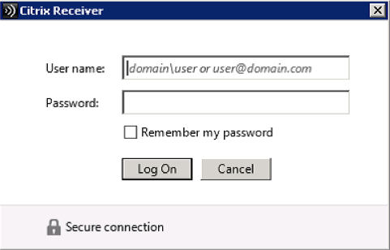
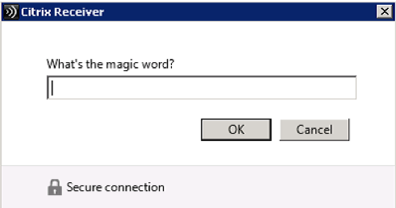
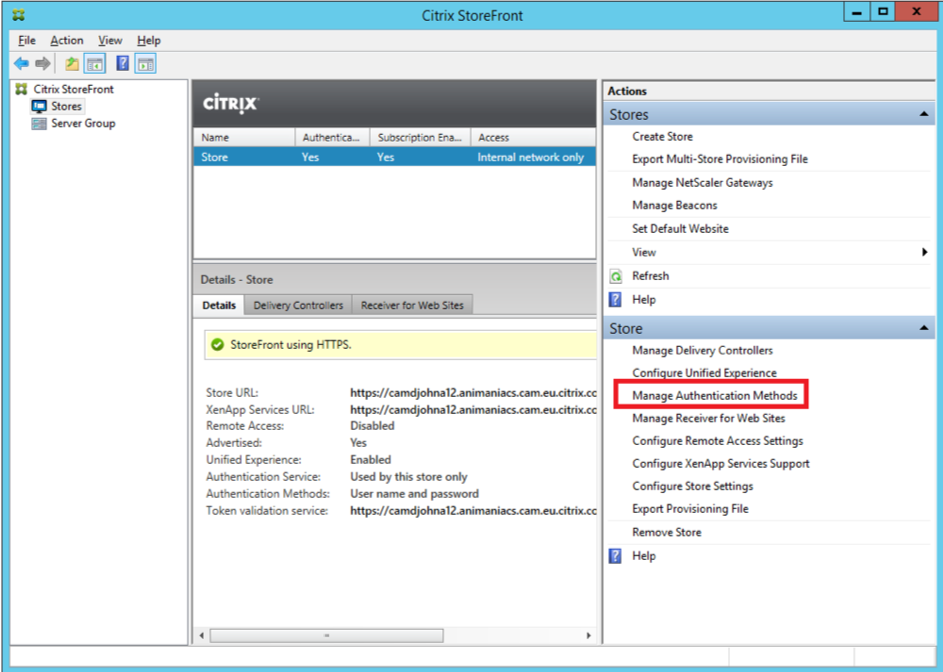
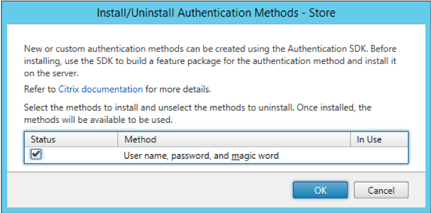
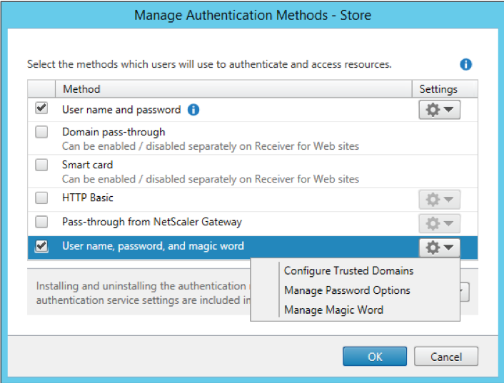
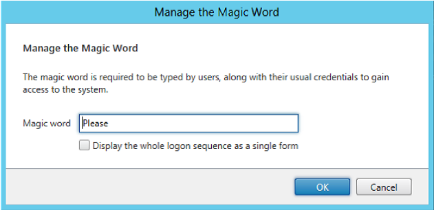

#Sample: Magic Word Forms

## Overview

### Introduction

This sample for the StoreFront Authentication SDK demonstrates how to create and add a custom form implementation to StoreFront. As described in the StoreFront Services Authentication SDK document, this protocol will be advertised to the clients as: CustomForms. The clients are required to recognize this protocol identifier and map it to their existing Common Forms rendering. Clients will give preference to this new protocol over the existing ExplicitForms protocol, should both be available.

**Note**: Only one authentication method can be deployed that advertises itself with a specific protocol choice name. Because Forms customizations rely on being advertised as CustomForms, this means that only one Forms customization can be installed on a StoreFront server.

### User Experience

This sample is a simple two-factor authentication protocol where the user has to supply both their password and a fixed “magic word”, as illustrated below in Citrix Receiver: 





The sample also demonstrates:

* How to extend the StoreFront Administration Console to add an action item that displays User Interface elements for configuring the protocol properties
* How to configure in the StoreFront Administration console: the “Magic Word” that users must supply, and whether or not the protocol is split over two forms or displayed as a single form.
* How to incorporate the standard change password functionality into a custom form.

### Administrator Experience

#### Administration Console

If the Magic Word sample is installed after a store has been created it will not automatically appear in the list of authentication methods for a store, when the “Manage Authentication Methods” action is selected.



However, if the Magic Word sample is installed before a Store is created, then it will automatically appear with the other authentication methods.

Selecting “Install or uninstall authentication methods” from the Advanced options, allows the newly installed Magic Word sample to be deployed, by selecting the “Status” checkbox.



Once the Magic Word sample has been deployed, it can then be managed using the same “Manage Authentication Methods” action as for the other authentication methods.



The required “magic word” settings can be configured by selecting the “Manage Magic Word” action item in the context area for this authentication method, which brings up the following dialog:



To remove the authentication customization, prior to uninstalling it, again use the “Install or uninstall authentication methods” from the Advanced options of the “Manage Authentication Methods” dialog. Unchecking the “Status” checkbox will remove the authentication method.

#### PowerShell

The feature can also be managed through PowerShell, after first adding all the StoreFront PowerShell modules:

```
Get-Module "Citrix.StoreFront.*" -ListAvailable | Import-Module
```

First the Magic Word StoreFront feature must be added:

```
Install-STFFeature -PackageName "MagicWordAuthentication"
```

The Authentication Service to which the Feature will be added, must then be found. This can be done either from the associated store, in this example, the store is named: “Store”, located at the virtual path: /Citrix/Store:

```
$store = Get-STFStoreService -VirtualPath "/Citrix/Store"

# Get the Authentication Service from the associated Store
$authService = Get-STFAuthenticationService -StoreService $store
```

Or by the virtual path of the Authentication Service, in this case: /Citrix/StoreAuth:

```
$authService = Get-STFAuthenticationService -VirtualPath "/Citrix/StoreAuth"
```

Once the Authentication Service has been located, then the feature must be added, using the associated name of the protocol choice, which in this case is: “CustomForms”:

```
Add-STFAuthenticationServiceProtocol -Name "CustomForms" -AuthenticationService $authService
```

The following will ensure that the Magic Word authentication method is enabled:

```
Enable-STFAuthenticationServiceProtocol -AuthenticationService $authService -Name "CustomForms"
```

The Magic Word configuration values can be accessed through the authentication settings of the Authentication Service, as follows:

```
$magicWord = $authService.AuthenticationSettings["magicWordAuthentication"]
```

This has four properties:

* **MagicWord**: The “magic” word to be supplied by the end users
* **SinglePage**: True or False, which determines whether all the fields appear on a single page, or the “magic” word is requested on a separate page.
* **ClaimsFactoryName**: This is the name of the claims factory to be used to generate the claims captured in the security token.
* **ConversationFactoryName**: This is the name of the Forms conversation factory name, and should be left as: MagicWordAuthentication

These can be changed either directly from the Authentication Service:

```
$authService.AuthenticationSettings["magicWordAuthentication"].MagicWord = "magic"
$authService.AuthenticationSettings["magicWordAuthentication"].SinglePage = $true
```

Or from the magic word model object

```
$magicWord.MagicWord = "magic"
$magicWord.SinglePage = $true
```

Changing any of these properties only changes the value in memory, to persist the change use the following command:

```
$authService.Save()
```

The magic word feature can be removed from an Authentication Service with the following command:

```
Remove-STFAuthenticationServiceProtocol -Name "CustomForms" -AuthenticationService $authService
```

### Installer

In common with the other samples, a pre-built installer is provided in addition to the source code.

Before attempting to deploy the pre-built sample installers, it is required to add the certificate at AuthSDK.zip/Certificates/YourCompany.cer to the Third-Party Root Certification Authorities store of the Local Computer account where StoreFront is installed. This is not required for the development machine. If this step is not completed, then the StoreFront Administration Console will display an error because the digital signature of the PowerShell modules associated with this customization will fail to verify.

The installer verifies that there is not an existing customization that implements CustomForms before deploying the StoreFront Feature package and the add-ins to the administration console. To actually deploy and enable a sample the “Add/Remove Methods” action from the “Authentication” node of the StoreFront Administration Console should be used.

**Note**: If the installer is being deployed to a StoreFront Server Group, it must be run on all servers in the group.

Before attempting to uninstall a sample, the associated authentication method must first be removed using the “Manage Authentication Methods” action from the “Stores” node of the StoreFront Administration Console, as described above. If this is not done, attempting to uninstall will result in a dialog informing the administrator that the feature should be removed using the StoreFront Administration Console first. The sample can then be removed by using the standard “Add/Remove Programs” control panel applet.

## Code Sample

### Visual Studio Solution Layout

This sample demonstrates as many aspects of the SDK as possible, and is composed of seven projects:

* Configuration contains the configuration section, the parser for the settings, and the object to hold the settings
* Feature contains the code that will be added to the Authentication Service to control the authentication process, including:
	* A custom conversation object and its associated factory
	* Custom forms and templates for both the single and multi-page variants
	* The start-up module used to populate the IoC container
	* A helper for event log messages
* FeatureInstaller contains the following:
	* A custom feature instance to demonstrate how to add custom steps during deployment
	* A demonstration of how to create a PowerShell command, and how to register the PowerShell snap-in
* Console.Extension contains the code for the administration console, including the data models, action handlers, business logic, and user interface elements.
* Installer is a WiX project to create an msi installer to deploy and remove the Magic Word Feature. It also contains the StoreFront Feature Package definition and builds the Feature Package.
* Installer.CustomActions contains the msi custom actions required to deploy and remove the Magic Word Feature.
* UnitTests contains some unit tests to verify the merging of the code and configuration into the authentication service, verify the behavior of the Service Locator, and verify the behavior of the authentication conversation.
All the projects target the .NET Framework 4.5 and the MSIL platform, unless specifically stated. Projects that target .NET Framework 3.5 are either part of the StoreFront Administration Console, or loaded by the Console. The rationale behind this is discussed in the StoreFront Services Authentication SDK document.

### Configuration Project

This C# class library project follows the standard pattern for a StoreFront configuration project and contains:

* A configuration section that controls how the settings are read from the Authentication Service web.config file
* A parser object that parses the configuration section and generates a settings object
* The settings object

**Notes**:

* This project is targeted at .NET Framework 3.5, because it will be used by the StoreFront PowerShell Configuration Provider, which is used by the StoreFront Administration Console. See the StoreFront Services Authentication SDK document for more information.
* In order for the StoreFront PowerShell Configuration Provider to be able to load the configuration section, this assembly must be placed in the .NET Global Assembly Cache, and so must be strongly named.

#### PowerShell SDK Support

This project also demonstrates how to add support for the PowerShell SDK.
The MagicWordModel class implements the following interface, in addition to the required configuration properties:

```
public interface IAuthenticationSettingsObject : IConfigObject
{
    IAuthenticationSettingsObject Clone();
}
```

The interface `IConfigObject` is a marker interface with no methods.

The configuration section implements the following interface:

```
namespace Citrix.StoreFrontConfiguration.Interfaces
{
    /// <summary>
    /// Marker interface to direct the configuration to be parsed into an
    /// authentication settings model object.
    /// </summary>
    public interface IAuthenticationSettingsSection : IConfigManagementSection
    {
    }
}
```

This requires the following methods to be implemented:

```
/// <summary>
/// Sets the configuration from the supplied model object.
/// </summary>
/// <param name="configurationObject">The configuration object.</param>
void Set(IConfigObject configurationObject);
```

```
/// <summary>
/// Gets the specified configuration object from the underlying configuration.
/// </summary>
/// <returns>The configuration object.</returns>
IConfigObject Get();
```

```
/// <summary>
/// Gets the name of the configuration section.
/// </summary>
/// <value>
/// The name of the section.
/// </value>
string SectionName { get; }
```

The Get and Set methods illustrate how to marshal to and from the configuration data to the MagicWord model object.

### Feature Project

This C# class library project contains the custom classes for controlling the forms conversation; see the StoreFront Authentication Form Generation document for more details. These classes include:

* The custom conversation and its associated factory
* Custom forms and templates for both the single and multi-page variants required by this conversation

The project also contains the start-up module that is responsible for populating the IoC container with the objects required for this custom conversation. See the StoreFront Services Authentication SDK document for more details regarding start-up modules. This start-up module adds the following:

* The parsed settings object
* The conversation factory
In addition, there is a class following the standard pattern for logging to aid with diagnostics.

### Console.Extension Project

This C# class library project contains:

* The authentication extension class to provide status messages including:
	* Stating that this customization will take precedence over user name and password
	* Optionally a message stating that Delegated Forms Authentication is available, and demonstrating how to have a link in a status message, in this case to the Delegated Forms Authentication read-me document.
	* Optionally a message stating that the Delegated Forms Authentication is not using this custom conversation, and providing a link to set Delegated Forms to use this conversation
	* The built-in action to manage change password options
	* The built-in action to manage trusted domains
	* The custom action to manage the settings for this customization
* The User Interface elements required for managing the settings, including the xaml and view model
* The PowerShell commands in a module for managing the settings
* The business logic object and the associated data model that utilizes the PowerShell
* The localizer class to provide the localized authentication method name in the StoreFront Administration Console

**Note**: This project is targeted at .NET Framework 3.5, because it will be loaded by the StoreFront Administration Console.

#### Installer Project

This WiX project is responsible for the following:

* Creating the Magic Word StoreFront Feature Package
* Creating an installer to:
	* Deploy the Feature Package
	* Deploy the StoreFront Administration Console extension
	* Update the registry so that the StoreFront Administration Console will load the extension

**Note**: This project is targeted at the x64 platform

#### Installer.CustomActions Project

This C# class library project uses the standard pattern, as described in the StoreFront Authentication SDK document, with the Feature identifier and Authentication Protocol Name set to appropriate values for this customization.

**Notes**:

* This project is targeted at .NET Framework 3.5.
* This project is targeted at the x64 platform to ensure that it has access to the correct registry locations.

#### Unit Tests Project

This project contains standard web.config merge and unmerge, route, and protocol choice tests, in addition to tests of the entire conversation including changing expired password and error cases.


